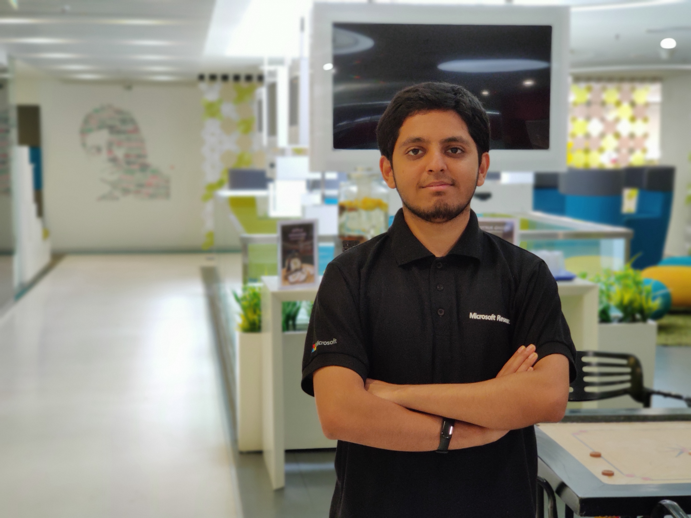

<!-- Shishir's Photo -->

 	

	<!-- <h2>Hi there, I'm Shishir Patil!</h2> -->
	

        I am a first year Ph.D. student in Computer Science at UC Berkeley. I am broadly interested in systems for machine learning, and machine learning for the edge.
        Previously, I spent two wonderful years as a <i>Research Fellow</i> at <a href ='https://www.microsoft.com/en-us/research/lab/microsoft-research-india/'>Microsoft Research India</a>, where I was advised by <a href='http://www.prateekjain.org/'>Prateek Jain</a> from the <em>Machine Learning and Optimization Group,</em> <a href='http://harsha-simhadri.org/'>Harsha Vardhan Simhadri</a> and <a href='https://www.microsoft.com/en-us/research/people/visesha/'>Vivek Seshadri</a> from the <em>Systems Group</em>.       
        <!-- <a href="/about">Read more about my life...</a> -->
    

    
News: 
    

        <ul style="list-style-type:none;">
         
        [Mar 2018] <a href = 'https://drive.google.com/file/d/1vQV4ENhC_lkg9FC7BLv6aRDP3e_VgWnX/view?usp=sharing'> Presented our work to Bill Gates!</a> 

        [Feb 2020] <a href = 'http://terminal.c1games.com/competitions/105'> We win (Cal #2) at Citadel Terminal Live: Cal vs Stanford 2020 </a> 
        [Jan 2020] <a href = 'https://simons.berkeley.edu/workshops/schedule/10559'> Attending The Quantum Wave in Computing Boot Camp at Simons Institute</a> 
        [Jan 2020] Presented poster at RISE Retreat [Monterey, CA] 
        [Jan 2020] Gave a talk at VMare Retreat [Palo Alto, CA] 
        [Nov 2019] <a href = 'https://twitter.com/BerkeleyISchool/status/1191542693446455298'> We <i>"The Bayesian Conspiracy"</i> win  PayPal Hack 2019</a> 
        <!-- [Aug 2019] Moved to UC Berkeley for my Ph.D.   -->
        [Jul 2019] <a href = 'http://uist.acm.org/uist2019/program/'> GesturePod accepted to UIST 2019!</a> 
        [Dec 2018] <a href = 'https://www.zdnet.com/video/microsoft-researchers-add-smarts-to-everyday-objects/?fbclid=IwAR3DCey1X675mQ-uk7mu1Wl8aFXM4AQGNL4SygercVQY6PsmDkFvO3P9BE8'>ZD Net covers our work at (NeurIPS) NIPS 2018</a> 
        [Nov 2018] <a href = 'https://nips.cc/Expo/Conferences/2018/Schedule?demo_id=3'> We will be presenting our work at (NeurIPS) NIPS 2018!</a> 
        [Nov 2018] Demonstrated programmable gesture recognition on Xbox controllers with EdgeML 
        [Oct 2018] <a href = 'https://github.com/Microsoft/EdgeML'> GesturePod implementation and simulation OSS</a> 
        <!-- 
        [Mar 2018] <a href = 'https://drive.google.com/file/d/1vQV4ENhC_lkg9FC7BLv6aRDP3e_VgWnX/view?usp=sharing'> Presented my work to Bill Gates!</a>  -->
        [Dec 2017] Our work covered by <a href='http://epaper.financialexpress.com/1462735/Indian-Express/December-11,-2017#page/8/1'>Financial Express</a> and <a href = 'https://blogs.microsoft.com/ai/ais-big-leap-tiny-devices-opens-world-possibilities/'>Microsoft AI blog</a>. 
        </ul>
    

    

    

    <!-- <h3>My Current Projects:</h3> -->
    <!-- 
 -->
        <!-- <ul> -->
        <!-- <li> -->
        <!-- <a href ='https://github.com/Microsoft/EdgeML'>Edge ML:</a>
         Machine learning predictions on edge devices (microcontrollers) are critical in many scenarios where we are constrained by latency and bandwidth or value data privacy and battery life. e.g., Internet of Things (IoT) and wearable electronics. In this project, we are designing new ML algorithms that generate tiny models that can enable prediction on edge devices with accuracy comparable to cloud solutions. <!-- These algorithms can be deployed on microcontrollers that use milliwatts of power and have just a few kB of RAM. -->
        <!-- </li> -->
        <!-- </ul> -->
    <!-- 
 -->

    <!-- 
 -->
        <!-- <ul> -->
        <!-- <li> -->
        <!-- PulsCity: Deploying IoT for urban cities involves 3 challenges:
        (a) Deploying sensor systems that capture the physical phenomenon (b)
        Transmission of data from the sensors to cloud/server and (c)
        Getting meaningful insights from the data.
        In this project, we propose novel techniques to build a scalable framework to address the communication component - transmission of data from the sensors to a centralized server. -->
        <!-- </li>  -->
        <!-- <i>My past projects can be found in my <a href='https://drive.google.com/file/d/1Fdmc4aNIdXnHyt9MQlyiXhmM2GKku8Ya/view?usp=sharing'>CV</a></i> -->
        <!-- </ul>  -->
    <!-- 
 -->

    <!-- 
 -->

    
 
        Prior to this, I obtained a B.E. in Electronics and Communication Engineering from R.V.
        College of Engineering in 2017 (awarded University Gold Medal). During my undergraduate 
        program, I worked with <a href ='http://www.cense.iisc.ac.in/m-m-nayak'>Prof. M.M. Nayak</a>
        from Center for Nano Science and Engineering, <a href = 'http://www.iisc.ac.in/'>Indian 
        Institute of Science</a> from 2016-2017. I was an intern with Siemens R&D in the
        summer of 2015.
    

<!-- /.blurb -->

